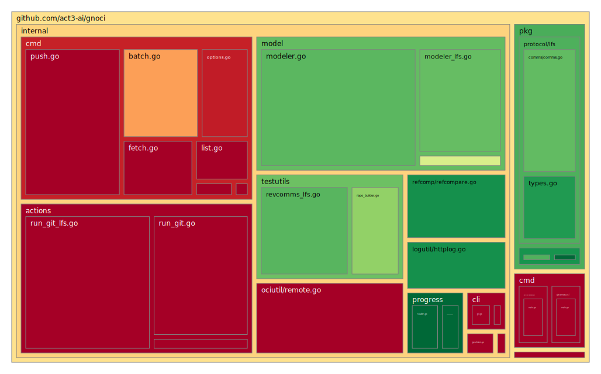

# Git o(n) OCI (gnoci)

Pronounced as gnocchi.

This project has three main objectives:

1. Define a specification for storing Git repositories as OCI artifacts.
2. Implement a Git remote helper to facilitate conversions of local Git repositories into remote OCI artifacts.
3. Implement a Git LFS remote helper to support conversions of Git LFS pointer files.

## OCI Specification

The data model for storing Git repositories in OCI compliant registries follows the [OCI image-spec](https://github.com/opencontainers/image-spec/blob/main/spec.md). In particular, the data model is packaged as defined by the [image manifest spec guidelines for artifact usage](https://github.com/opencontainers/image-spec/blob/main/manifest.md#guidelines-for-artifact-usage).

Refer to the [Git OCI Artifact Specification](docs/spec/oci-spec.md).

## Git Remote Helper for OCI Registries

`git-remote-oci` is a Git [remote helper](https://git-scm.com/docs/gitremote-helpers) that implements a custom protocol for interacting with Git repositories stored in OCI compliant registries. It is designed to allow users to interact with `git` as they normally do in their day-to-day workflows, but use an OCI registry as remote storage. It does not require `git-lfs-remote-oci`.

`git-remote-oci` supports:

- Cloning
- Fetching/Pulling
- Pushing
- Evaluating remote references
- Any native Git actions involving a remote

## Git LFS Remote Helper for OCI Registries

`git-lfs-remote-oci` is a Git LFS [custom transfer agent](https://github.com/git-lfs/git-lfs/blob/main/docs/custom-transfers.md) that implements the Git LFS [custom transfer protocol](https://github.com/git-lfs/git-lfs/blob/main/docs/custom-transfers.md#protocol). Specifically, it is a [standalone transfer agent](https://github.com/git-lfs/git-lfs/blob/main/docs/custom-transfers.md#using-a-custom-transfer-type-without-the-api-server) that does not require an LFS API server.

`git-lfs-remote-oci` supports all `git-lfs` features that involve a remote.

`git-lfs-remote-oci` does not require `git-remote-oci`.

## Purpose

Why use OCI registries as remote storage for Git repositories?

Existing tools, such as [Zarf](https://zarf.dev/) and the [ASCE Data Tool](https://github.com/act3-ai/data-tool), provide solutions for moving OCI images and artifacts across air-gapped environments. The primary use-case for the `oci` remote helper protocol is to efficiently transfer and store Git repositories in OCI registries to complement the air-gap capabilities of these tools.

For more information see the [project proposal](./docs/proposal/proposal.md).

## Documentation

The documentation for `git-remote-oci` and `git-lfs-remote-oci` is organized as follows:

- **[Installation Guide](docs/installation-guide.md)**: how to install `git-remote-oci` and `git-lfs-remote-oci` from source.
- **[Quick Start Guide](docs/quick-start-guide.md)**: provides initial usage of and configuration for `git-remote-oci` and `git-lfs-remote-oci`.
- **[User Guide](docs/user-guide.md)**: provides usage examples.
- **[OCI Specification](docs/spec/oci-spec.md)**: defines the Git OCI artifact specification.
- **[Data Model](docs/spec/data-model.md)**: extends the specification by discussing the data model, intended for developers.
- **[Sequence Diagrams](docs/diagrams/sequence/)**: outline how `git`, `git-remote-oci`, `git-lfs`, and `git-lfs-remote-oci` interact with one another.

## How to Contribute

- **[Developer Guide](docs/developer-guide.md)**: detailed guide for contributing to this project.

## Support

- **[Troubleshooting FAQ](docs/troubleshooting-faq.md)**: frequently asked questions and their answers.

## Code Coverage

