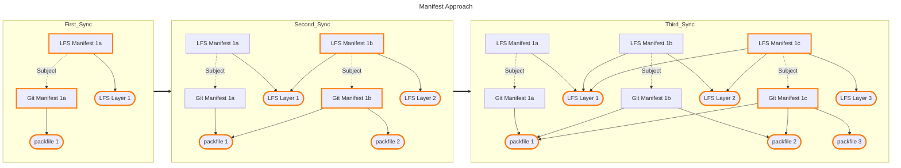

# Git as OCI Artifact Data Model

The data model for storing Git repositories in OCI compliant registries follows the [OCI image-spec](https://github.com/opencontainers/image-spec/blob/main/spec.md). In particular, the data model is packaged as defined by the [image manifest spec guidelines for artifact usage](https://github.com/opencontainers/image-spec/blob/main/manifest.md#guidelines-for-artifact-usage).


## Git OCI Artifact Design

### Git Artifact Manifest

The data model for storing a Git artifact defines a configuration and at least one layer. As such, the data model follows the [guidelines for artifact usage](https://github.com/opencontainers/image-spec/blob/main/manifest.md#guidelines-for-artifact-usage) decision tree number 3 by defining three custom types:

- `application/vnd.ai.act3.git.repo.v1+json` - Manifest `artifactType`
- `application/vnd.ai.act3.git.config.v1+json` - Config `mediaType`
- `application/vnd.ai.act3.git.pack.v1` - Layer `mediaType`

Additionally, two annotations are defined:

- `vnd.ai.act3.git-remote-oci.version` - The version of the `git-remote-oci` remote helper that created the artifact.
- `org.opencontainers.image.created` - Set to `1970-01-01T00:00:00Z`

#### Example Git Manifest

```json
{
  "schemaVersion": 2,
  "mediaType": "application/vnd.oci.image.manifest.v1+json",
  "artifactType": "application/vnd.ai.act3.git.repo.v1+json",
  "config": {
    "mediaType": "application/vnd.ai.act3.git.config.v1+json",
    "digest": "sha256:28262ebd6a50230a95ddfbe9b55172121c721f214887107c6052355a6e6da5a9",
    "size": 1168
  },
  "layers": [
    {
      "mediaType": "application/vnd.ai.act3.git.pack.v1",
      "digest": "sha256:297b82b44c1c86e088cc95a68fd1d525878e4f430e48053ab6074e7cfe5c6d83",
      "size": 3191893,
      "annotations": {
        "org.opencontainers.image.title": "pack-53e257abe0aeabfb40bae4bb7e37b4466f988481.pack"
      }
    },
    {
      "mediaType": "application/vnd.ai.act3.git.pack.v1",
      "digest": "sha256:e3b0c44298fc1c149afbf4c8996fb92427ae41e4649b934ca495991b7852b855",
      "size": 641,
      "annotations": {
        "org.opencontainers.image.title": "pack-nfe347abe0aeabd40bagh4bb7e43b4466f988481.pack"
      }
    }
  ],
  "annotations": {
    "org.opencontainers.image.created": "1970-01-01T00:00:00Z",
    "vnd.ai.act3.git-remote-oci.version": "v0.0.0-alpha"
  }
}
```

### Git Artifact Config

The data model utilizes an OCI config for storing Git references. Alongside the commit a reference refers to, the config stores the OCI layer whose packfile contains the commit. The config defines two maps, containing head and tag references separately. Additional reference types, such as notes, may be added at a later date.

#### Example Git Config

This config corresponds with the example manifest above. All references were included in the initial packfile, with only the `main` branch updated in the second "thin" packfile layer.

```json
{
  "heads": {
    "refs/heads/act3-pt/blueprints/render-orphan": {
      "commit": "d2d51a405e5168f1945a02035c8f6089da53cb04",
      "layer": "sha256:297b82b44c1c86e088cc95a68fd1d525878e4f430e48053ab6074e7cfe5c6d83"
    },
    "refs/heads/command-fetch": {
      "commit": "56db9a50f127dae1a0da3563cb205a45ee077208",
      "layer": "sha256:297b82b44c1c86e088cc95a68fd1d525878e4f430e48053ab6074e7cfe5c6d83"
    },
    "refs/heads/command-list": {
      "commit": "8741ea9910f853de6ea90709e2195a0558b5f3ce",
      "layer": "sha256:297b82b44c1c86e088cc95a68fd1d525878e4f430e48053ab6074e7cfe5c6d83"
    },
    "refs/heads/command-push": {
      "commit": "fa789ae0105a816244715e76f692cef04a6701a6",
      "layer": "sha256:297b82b44c1c86e088cc95a68fd1d525878e4f430e48053ab6074e7cfe5c6d83"
    },
    "refs/heads/design-docs": {
      "commit": "21023d360200012cefcd8f077b3b24aea7cb20f2",
      "layer": "sha256:297b82b44c1c86e088cc95a68fd1d525878e4f430e48053ab6074e7cfe5c6d83"
    },
    "refs/heads/main": {
      "commit": "44ad7a87cd3726cb4c270a4b1ea3fca5185abafc",
      "layer": "sha256:e3b0c44298fc1c149afbf4c8996fb92427ae41e4649b934ca495991b7852b855"
    },
    "refs/heads/setup-project": {
      "commit": "ced7d65b2dbdd91b9231b8edab51bac53415de2f",
      "layer": "sha256:297b82b44c1c86e088cc95a68fd1d525878e4f430e48053ab6074e7cfe5c6d83"
    }
  },
  "tags": {
    "refs/tags/foobar": {
      "commit": "21023d360200012cefcd8f077b3b24aea7cb20f2",
      "layer": "sha256:297b82b44c1c86e088cc95a68fd1d525878e4f430e48053ab6074e7cfe5c6d83"
    }
  }
}
```

### Git Artifact Layers

Each artifact layer is a Git [packfile](https://git-scm.com/docs/pack-format), identified by the `application/vnd.ai.act3.git.pack.v1` `mediaType`. The first packfile in each artifact manifest (`layers[0]`) is [self-contained](https://git-scm.com/docs/git-pack-objects#_description), and may be unpacked without any additional information. All other packfiles (`layers[1:len(layers-1)]`) are ["thin" packs](https://git-scm.com/docs/git-pack-objects#Documentation/git-pack-objects.txt---thin) requiring a subset of the objects present in the previous packfile(s).

The decision to use packfiles was based on the following criteria:

- Minimize data transfer
- Minimize data storage in OCI

By using packfiles, the data model reduces OCI storage space and data transfer by storing objects in [deltified representation](https://git-scm.com/docs/pack-format#_deltified_representation).

See [limitations of packfiles](#usage-of-packfiles).

### Git Artifact Creation and Updates

#### Initial Git Artifact

When pushing the Git OCI artifact to a remote OCI registry for the first time, i.e. the [OCI tag reference](https://github.com/opencontainers/distribution-spec/blob/main/spec.md#checking-if-content-exists-in-the-registry) does not exist, a [packfile](https://git-scm.com/docs/pack-format) is created containing all git objects reachable from the references pushed. In effect, the packfile contains the complete git history for each reference. This packfile serves as the base layer for subsequent updates. Additionally, each tag or head reference pushed is added to the artifact config alongside the digest of the packfile layer created.

#### Subsequent Git Updates

If a Git OCI artifact reference already exists, `git-remote-oci` creates a single ["thin" pack](https://git-scm.com/docs/git-pack-objects#Documentation/git-pack-objects.txt---thin) containing reachable objects not included in any existing packfile layers. Any reference updates are reflected in the OCI config.

## LFS OCI Artifact Design

The data model uses the OCI [referrers API](https://github.com/opencontainers/distribution-spec/blob/main/spec.md#listing-referrers) for managing `git-lfs` tracked files. As such, if a local repository has `git-lfs` configured the [Git OCI manifest](#git-artifact-manifest) descriptor is added as a `subject` in the LFS artifact manifest.

### LFS Artifact Manifest

The LFS OCI manifest defines two custom types:

- `application/vnd.ai.act3.git-lfs.repo.v1+json` - Manifest `artifactType`
- `application/vnd.ai.act3.git-lfs.object.v1` - Layer `mediaType`

The data model does not require a configuration, instead the `config` descriptor is set to the empty descriptor.

The same annotations as the [Git artifact manifest](#git-artifact-manifest) are defined:

- `vnd.ai.act3.git-remote-oci.version` - The version of the `git-remote-oci` remote helper that created the artifact.
- `org.opencontainers.image.created` - Set to `1970-01-01T00:00:00Z`

#### Example LFS Manifest

```json
{
  "schemaVersion": 2,
  "mediaType": "application/vnd.oci.image.manifest.v1+json",
  "artifactType": "application/vnd.ai.act3.git-lfs.repo.v1+json",
  "config": {
    "mediaType": "application/vnd.oci.empty.v1+json",
    "digest": "sha256:44136fa355b3678a1146ad16f7e8649e94fb4fc21fe77e8310c060f61caaff8a",
    "size": 2,
    "data": "e30="
  },
  "layers": [
    {
      "mediaType": "application/vnd.ai.act3.git-lfs.object.v1",
      "digest": "sha256:189aaa97e4312694a44aaf5588827366b3e35869be1b55dde4bef19e0a7d23c8",
      "size": 344646,
      "annotations": {
        "org.opencontainers.image.title": "189aaa97e4312694a44aaf5588827366b3e35869be1b55dde4bef19e0a7d23c8"
      }
    },
    {
      "mediaType": "application/vnd.ai.act3.git-lfs.object.v1",
      "digest": "sha256:e5d4a2a85dc82a1ce91408e0263457e323c51b8a0c8771f11087b5f4bb47006f",
      "size": 197833,
      "annotations": {
        "org.opencontainers.image.title": "e5d4a2a85dc82a1ce91408e0263457e323c51b8a0c8771f11087b5f4bb47006f"
      }
    },
  ],
  "subject": {
    "mediaType": "application/vnd.oci.image.manifest.v1+json",
    "digest": "sha256:cdcfe254d7349f040393ec327d8bdea13c75b12e7f8dce1b72c9a694e082bfe5",
    "size": 637,
    "annotations": {
      "org.opencontainers.image.created": "1970-01-01T00:00:00Z",
      "vnd.ai.act3.git-remote-oci.version": "v0.0.0-alpha"
    },
    "artifactType": "application/vnd.ai.act3.git.repo.v1+json"
  },
  "annotations": {
    "org.opencontainers.image.created": "1970-01-01T00:00:00Z",
    "vnd.ai.act3.git-remote-oci.version": "v0.0.0-alpha"
  }
}
```

### LFS Artifact Config

The data model does not require a configuration, instead the `config` descriptor is set to the empty descriptor.

### LFS Artifact Layers

LFS artifact layers are identified by the `application/vnd.ai.act3.git-lfs.object.v1` `mediaType`. Each layer contains the contents of a single `git-lfs` tracked file, fetched on-demand when a `git-lfs` pointer file needs to be resolved to the full file contents.

### LFS Artifact Creation and Updates

An LFS artifact is only created if a local repository has `git-lfs` configured.

#### Initial LFS Artifact

The initial LFS artifact is created the first time a `git` commit object contains one or more `git-lfs` tracked files. The manifest contains a single layer for each LFS file.

#### Subsequent LFS Updates

If an LFS artifact already exists, additional LFS files are appended to the LFS manifest layers.

## Full Git & LFS Artifact Diagram

Elements outlined in orange indicate the active graph for the OCI reference at that point in time.



## Artifact Distribution

### Data Race Prevention

By using OCI tag references as the git remote reference format, distributing the Git OCI artifact is susceptible to data race issues if two users are pushing to the same remote reference simultaneously. To avoid such a conflit, `git-remote-oci` takes the following measures:

- Conditional pushes with `ETag` header, depending on registry support.
  - "Clients MAY use a conditional HTTP push for registries that support ETag conditions to avoid conflicts with other clients." See [OCI distribution spec](https://github.com/opencontainers/distribution-spec/blob/main/spec.md#referrers-tag-schema).
- After pushing by digest, re-resolve the OCI tag reference to a digest just before tagging.
  - This method does not fully eliminate the data race.

## Limitations

### Maximum Manifest Size

Although the OCI does not specify strict [manifest size limitations](https://github.com/opencontainers/distribution-spec/blob/main/spec.md#pushing-manifests), also see [spec v1.1 releases](https://opencontainers.org/posts/blog/2024-03-13-image-and-distribution-1-1/#manifest-maximum-size), it does suggest at least a 4MiB image manifest size limit. Many clients and registries enforce their own size limits. As such, at some point in time packfiles in the artifact are "merged" to accommodate the manifest size limitation.

### Usage of Packfiles

The use of packfiles as artifact layers helps to reduce OCI registry storage space and push times. However, fetching from the OCI remote can be costly as the minimum amount of data that can be fetched is a packfile layer. Depending on the state of the local repository and the Git OCI artifact, only a subset of a packfile layer is actually needed; resulting in wasted data transfer. Although initially fetching more objects than necessary, this behavior can be beneficial in some cases. For instance, a user fetches `ref/heads/foo` and the remote packfile containing the objects needed to update `ref/heads/foo` also contains objects for `ref/heads/bar`. Because `git-remote-oci` loads the entire packfile into the local repository, a subsequent fetch for `ref/heads/bar`  only requires fetching the OCI config metadata; where `git` recognizes the objects for `ref/heads/bar` already exist locally.
