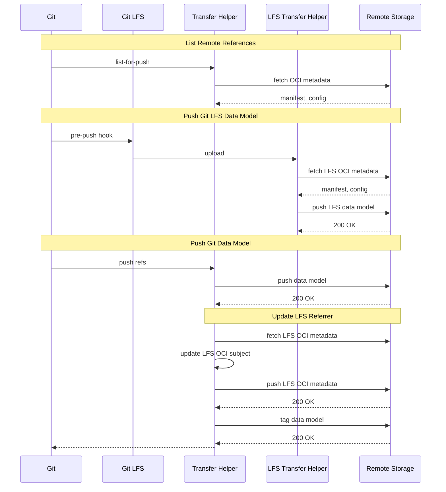

# Git and Git LFS Combined

## Summary

1. `git push oci://... main`
2. `git-remote-oci <shortname> oci://...` - list refs
3. `git pre-push`
4. `git-lfs pre-push oci://...`
5. `git-lfs-remote-oci` - push LFS files
6. `git`
7. `git-remote-oci` - push packfiles

## Sequence Diagram

Note: `git-remote-oci` and `git-lfs-remote-oci` are separate processes.



## Raw debug output

```console
$ GIT_TRACE=1 GIT_TRANSFER_TRACE=1 GIT_LFS_DEBUG=1 git push registry --all

18:10:30.889226 git.c:476               trace: built-in: git push registry --all
18:10:30.889452 run-command.c:673       trace: run_command: GIT_DIR=.git git remote-oci registry oci://127.0.0.1:5000/oct13/test2/foo:sync
18:10:30.889476 run-command.c:765       trace: start_command: /usr/lib/git-core/git remote-oci registry oci://127.0.0.1:5000/oct13/test2/foo:sync
18:10:30.890666 git.c:773               trace: exec: git-remote-oci registry oci://127.0.0.1:5000/oct13/test2/foo:sync
18:10:30.890711 run-command.c:673       trace: run_command: git-remote-oci registry oci://127.0.0.1:5000/oct13/test2/foo:sync
18:10:30.890738 run-command.c:765       trace: start_command: /home/njoslin/go/bin/git-remote-oci registry oci://127.0.0.1:5000/oct13/test2/foo:sync
18:10:30.965029 run-command.c:673       trace: run_command: .git/hooks/pre-push registry oci://127.0.0.1:5000/oct13/test2/foo:sync
18:10:30.965045 run-command.c:765       trace: start_command: .git/hooks/pre-push registry oci://127.0.0.1:5000/oct13/test2/foo:sync
18:10:30.966878 git.c:773               trace: exec: git-lfs pre-push registry oci://127.0.0.1:5000/oct13/test2/foo:sync
18:10:30.966921 run-command.c:673       trace: run_command: git-lfs pre-push registry oci://127.0.0.1:5000/oct13/test2/foo:sync
18:10:30.966939 run-command.c:765       trace: start_command: /usr/bin/git-lfs pre-push registry oci://127.0.0.1:5000/oct13/test2/foo:sync
18:10:30.970252 trace git-lfs: exec: git 'version'
18:10:30.972315 trace git-lfs: exec: git '-c' 'filter.lfs.smudge=' '-c' 'filter.lfs.clean=' '-c' 'filter.lfs.process=' '-c' 'filter.lfs.required=false' 'remote' '-v'
18:10:30.973727 trace git-lfs: exec: git '-c' 'filter.lfs.smudge=' '-c' 'filter.lfs.clean=' '-c' 'filter.lfs.process=' '-c' 'filter.lfs.required=false' 'remote'
18:10:30.975106 trace git-lfs: exec: git '-c' 'filter.lfs.smudge=' '-c' 'filter.lfs.clean=' '-c' 'filter.lfs.process=' '-c' 'filter.lfs.required=false' 'rev-parse' 'HEAD' '--symbolic-full-name' 'HEAD'
18:10:30.977073 trace git-lfs: exec: git '-c' 'filter.lfs.smudge=' '-c' 'filter.lfs.clean=' '-c' 'filter.lfs.process=' '-c' 'filter.lfs.required=false' 'rev-parse' '--git-dir' '--show-toplevel'
18:10:30.978504 trace git-lfs: exec: git 'config' '--includes' '-l'
18:10:30.979826 trace git-lfs: exec: git 'rev-parse' '--is-bare-repository'
18:10:30.980977 trace git-lfs: exec: git 'config' '--includes' '-l' '--blob' ':.lfsconfig'
18:10:30.982155 trace git-lfs: exec: git 'config' '--includes' '-l' '--blob' 'HEAD:.lfsconfig'
18:10:30.983756 trace git-lfs: pre-push: refs/heads/main 14728a774aecf1bb3333c70c6bf1e3ff5a3d5dc4 refs/heads/main 0000000000000000000000000000000000000000
18:10:30.983804 trace git-lfs: exec: git '-c' 'filter.lfs.smudge=' '-c' 'filter.lfs.clean=' '-c' 'filter.lfs.process=' '-c' 'filter.lfs.required=false' 'show-ref'
18:10:30.985074 trace git-lfs: exec: git '-c' 'filter.lfs.smudge=' '-c' 'filter.lfs.clean=' '-c' 'filter.lfs.process=' '-c' 'filter.lfs.required=false' 'ls-remote' '--heads' '--tags' '-q' 'registry'
18:10:31.011743 trace git-lfs: tq: running as batched queue, batch size of 100
18:10:31.011918 trace git-lfs: run_command: git rev-list --objects --ignore-missing --not --remotes=registry --stdin --
18:10:31.011939 trace git-lfs: exec: git '-c' 'filter.lfs.smudge=' '-c' 'filter.lfs.clean=' '-c' 'filter.lfs.process=' '-c' 'filter.lfs.required=false' 'rev-list' '--objects' '--ignore-missing' '--not' '--remotes=registry' '--stdin' '--'
18:10:31.012379 trace git-lfs: exec: git '-c' 'filter.lfs.smudge=' '-c' 'filter.lfs.clean=' '-c' 'filter.lfs.process=' '-c' 'filter.lfs.required=false' 'cat-file' '--batch-check'
18:10:31.012763 trace git-lfs: exec: git '-c' 'filter.lfs.smudge=' '-c' 'filter.lfs.clean=' '-c' 'filter.lfs.process=' '-c' 'filter.lfs.required=false' 'rev-parse' '--git-common-dir'
18:10:31.014371 trace git-lfs: tq: sending batch of size 1
18:10:31.014425 trace git-lfs: tq: starting transfer adapter "oci"                                                                                                                      
18:10:31.014436 trace git-lfs: xfer: adapter "oci" Begin() with 1 workers
18:10:31.014441 trace git-lfs: xfer: starting up custom transfer process "oci" for worker 0
18:10:31.014557 trace git-lfs: exec: sh '-c' 'git-lfs-remote-oci '
18:10:31.014795 trace git-lfs: xfer: Custom adapter worker 0 sending message: {"event":"init","operation":"upload","remote":"registry","concurrent":false,"concurrenttransfers":8}
18:10:31.037880 trace git-lfs: xfer: Custom adapter worker 0 received response: {}
18:10:31.038008 trace git-lfs: xfer: started custom adapter process "git-lfs-remote-oci" for worker 0 OK
18:10:31.038023 trace git-lfs: xfer: adapter "oci" started
18:10:31.038056 trace git-lfs: xfer: adapter "oci" worker 0 starting
18:10:31.038085 trace git-lfs: xfer: adapter "oci" worker 0 processing job for "e5d4a2a85dc82a1ce91408e0263457e323c51b8a0c8771f11087b5f4bb47006f"
18:10:31.038209 trace git-lfs: xfer: Custom adapter worker 0 sending message: {"event":"upload","oid":"e5d4a2a85dc82a1ce91408e0263457e323c51b8a0c8771f11087b5f4bb47006f","size":13,"path":"/tmp/test/lfstestsourcecomplex/.git/lfs/objects/e5/d4/e5d4a2a85dc82a1ce91408e0263457e323c51b8a0c8771f11087b5f4bb47006f","action":null}
18:10:31.038365 trace git-lfs: xfer: Custom adapter worker 0 received response: {"event":"progress","oid":"e5d4a2a85dc82a1ce91408e0263457e323c51b8a0c8771f11087b5f4bb47006f","bytesSoFar":1,"bytesSinceLast":1}
18:10:31.038399 trace git-lfs: xfer: Custom adapter worker 0 received response: {"event":"complete","oid":"e5d4a2a85dc82a1ce91408e0263457e323c51b8a0c8771f11087b5f4bb47006f"}
18:10:31.038408 trace git-lfs: xfer: adapter "oci" worker 0 finished job for "e5d4a2a85dc82a1ce91408e0263457e323c51b8a0c8771f11087b5f4bb47006f"
18:10:31.038448 trace git-lfs: xfer: adapter "oci" End()
18:10:31.038453 trace git-lfs: xfer: adapter "oci" worker 0 stopping
18:10:31.038456 trace git-lfs: xfer: Shutting down adapter worker 0
18:10:31.038540 trace git-lfs: xfer: Custom adapter worker 0 sending message: {"event":"terminate"}
18:10:31.080262 trace git-lfs: xfer: adapter "oci" stopped
18:10:31.080346 trace git-lfs: filepathfilter: creating pattern ".git" of type gitignore                                                                                                
18:10:31.080377 trace git-lfs: filepathfilter: creating pattern "**/.git" of type gitignore
18:10:31.080415 trace git-lfs: filepathfilter: accepting "tmp"
To oci://127.0.0.1:5000/oct13/test2/foo:sync
 * [new branch]      main -> main
```
