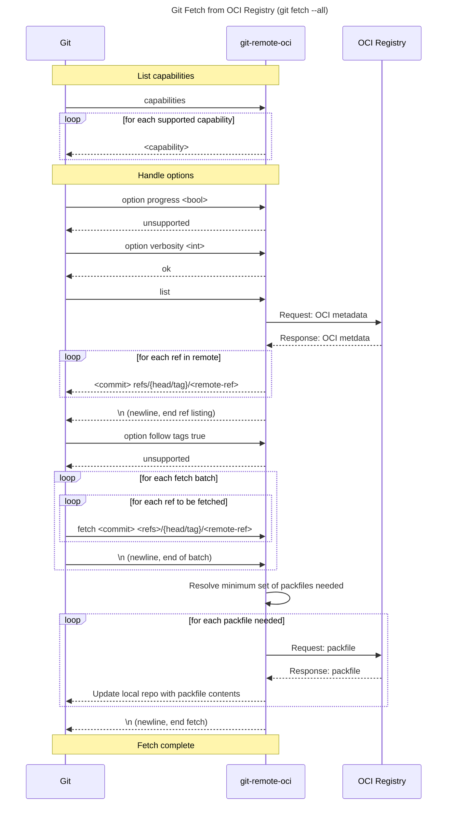

```mermaid
sequenceDiagram
    title Git Fetch from OCI Registry (git fetch --all)

    participant Git
    participant Helper as git-remote-oci
    participant OCI as OCI Registry

    Note over Git, Helper: List capabilities
    Git->>Helper: capabilities

    loop for each supported capability
    Helper-->>Git: <capability>
    end

    Note over Git, Helper: Handle options
    Git->>Helper: option progress <bool>
    Helper-->>Git: unsupported

    Git->>Helper: option verbosity <int>
    Helper-->>Git: ok

    Git->>Helper: list
    Helper->>OCI: Request: OCI metadata
    OCI-->>Helper: Response: OCI metdata

    loop for each ref in remote
        Helper-->>Git: <commit> refs/{head/tag}/<remote-ref>
    end
    Helper-->>Git: \n (newline, end ref listing)

    Git->>Helper: option follow tags true
    Helper-->>Git: unsupported

    loop for each fetch batch
        loop for each ref to be fetched
            Git->>Helper: fetch <commit> <refs>/{head/tag}/<remote-ref>
        end
        Git->>Helper: \n (newline, end of batch)
    end

    Helper->>Helper: Resolve minimum set of packfiles needed
    loop for each packfile needed
        Helper->>OCI: Request: packfile
        OCI-->>Helper: Response: packfile
        Helper-->>Git: Update local repo with packfile contents
    end

    Helper-->>Git: \n (newline, end fetch)
    Note over Git, Helper: Fetch complete
```