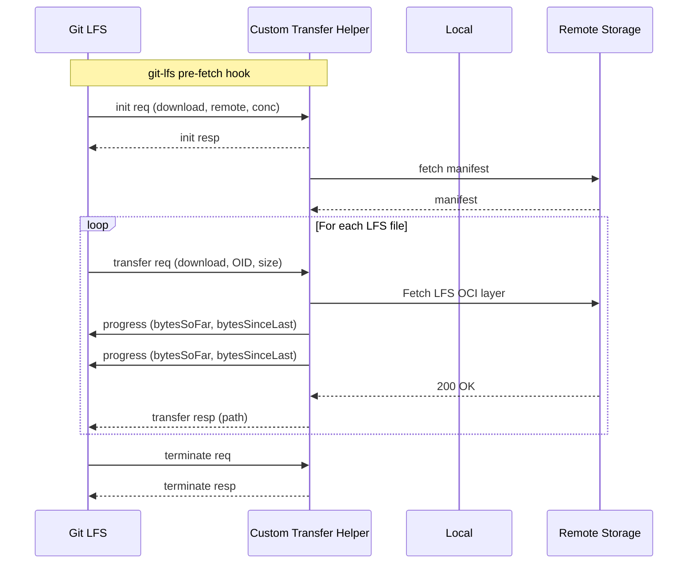

# Git LFS Fetch Sequence Diagram

Note: Every response (resp) to git-lfs requests (req) can return an error code and message.

```mermaid
sequenceDiagram
    participant LFS as Git LFS
    participant Helper as Custom Transfer Helper
    participant LocalStorage as Local
    participant Remote as Remote Storage

    Note over LFS,Helper: git-lfs pre-fetch hook

    %% Initialization (operation, remote name, concurrency options)
    %% op: upload/download
    %% remote: shortname or full URL
    LFS->>Helper: init req (download, remote, conc)
    Helper-->>LFS: init resp

    Helper->>Remote: fetch manifest
    Remote-->>Helper: manifest

    %% Prepare loop
    loop For each LFS file
        LFS->>Helper: transfer req (download, OID, size)
        Helper->>Remote: Fetch LFS OCI layer
        Helper->>LFS: progress (bytesSoFar, bytesSinceLast)
        Helper->>LFS: progress (bytesSoFar, bytesSinceLast)
        Remote-->>Helper: 200 OK
        Helper-->>LFS: transfer resp (path)
    end

    %% Termination
    LFS->>Helper: terminate req
    Helper-->>LFS: terminate resp
```
