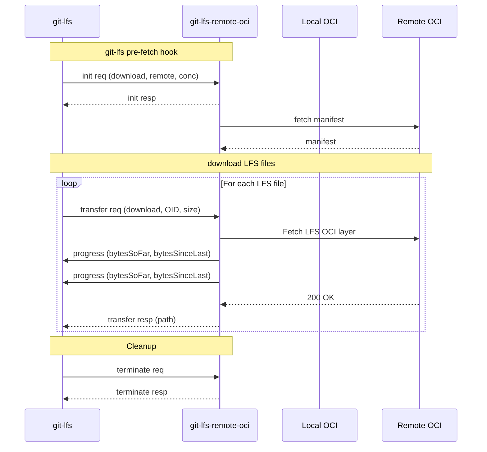

# Git LFS Fetch Sequence Diagram

Note: Every response (resp) to git-lfs requests (req) can return an error code and message.

Legend:

- git-lfs: `git-lfs` process.
- git-lfs-remote-oci: `git-lfs-remote-oci` process.
- Local OCI: local OCI storage, prepares LFS files as OCI layers.
- Remote OCI: remote OCI storage, the `oci://<url>` push destination.

