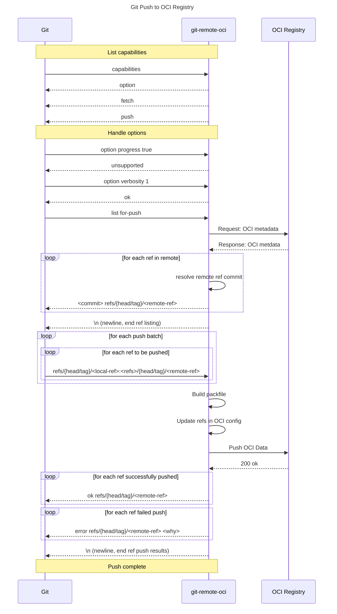

```mermaid
sequenceDiagram
    title Git Push to OCI Registry

    participant Git
    participant Helper as git-remote-oci
    participant OCI as OCI Registry

    Note over Git, Helper: List capabilities
    Git->>Helper: capabilities
    Helper-->>Git: option
    Helper-->>Git: fetch
    Helper-->>Git: push

    Note over Git, Helper: Handle options
    Git->>Helper: option progress true
    Helper-->>Git: unsupported

    Git->>Helper: option verbosity 1
    Helper-->>Git: ok

    Git->>Helper: list for-push
    Helper->>OCI: Request: OCI metadata
    OCI-->>Helper: Response: OCI metdata

    loop for each ref in remote
        Helper->>Helper: resolve remote ref commit
        Helper-->>Git: <commit> refs/{head/tag}/<remote-ref>
    end
    Helper-->>Git: \n (newline, end ref listing)

    loop for each push batch
        loop for each ref to be pushed
            Git->>Helper: refs/{head/tag}/<local-ref>:<refs>/{head/tag}/<remote-ref>
        end
    end

    Helper->>Helper: Build packfile
    Helper->>Helper: Update refs in OCI config

    Helper->>OCI: Push OCI Data
    OCI-->>Helper: 200 ok

    loop for each ref successfully pushed
        Helper-->>Git: ok refs/{head/tag}/<remote-ref>
    end
    loop for each ref failed push
        Helper-->>Git: error refs/{head/tag}/<remote-ref> <why>
    end

    Helper-->>Git: \n (newline, end ref push results)
    Note over Git, Helper: Push complete
```