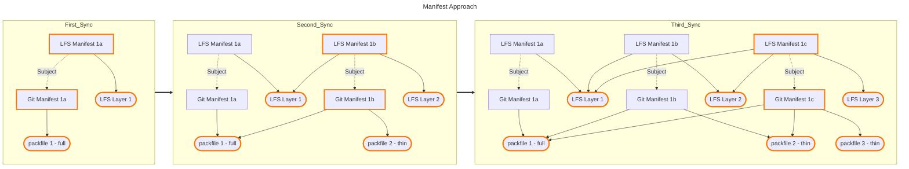

# OCI Data Model

This document extends the [Git as OCI Artifact Specification](oci-spec.md) by discussing the Git packfile data model, it's benefits, and limitations.

## Manifest Limitations

### Maximum Manifest Size

Although the OCI does not specify strict [manifest size limitations](https://github.com/opencontainers/distribution-spec/blob/main/spec.md#pushing-manifests), also see [spec v1.1 releases](https://opencontainers.org/posts/blog/2024-03-13-image-and-distribution-1-1/#manifest-maximum-size), it does suggest at least a 4MiB image manifest size limit. Many clients and registries enforce their own size limits. As such, at some point in time packfiles in the artifact are "merged" to accommodate the manifest size limitation.

As a rough estimation, a manifest would need over 16,000 pushes before reaching 4MiB:

Assuming:

- 435 byte manifest, with no layers
- 252 bytes for each layer descriptor in manifest
- 4 MiB size

((4.194304e+6) - 435 ) / 252 = 16 642.3373 pushes

## Packfiles as OCI Layers

Each artifact layer is a Git [packfile](https://git-scm.com/docs/pack-format), identified by the `application/vnd.ai.act3.git.pack.v1` `mediaType`. The first packfile in each artifact manifest (`layers[0]`) is [self-contained](https://git-scm.com/docs/git-pack-objects#_description), and may be unpacked without any additional information. All other packfiles (`layers[1:len(layers-1)]`) are ["thin" packs](https://git-scm.com/docs/git-pack-objects#Documentation/git-pack-objects.txt---thin) requiring objects outside of itself to be properly used; objects already present in the fetching repository or within the prior packfile(s). Effectively, the data model is a linked-list.

The decision to use packfiles in this manner was based on the following criteria:

- Minimize data transfer
- Minimize data storage in OCI
- Expected usage performing large "batches" of repository updates

### Creating Optimal Packfiles

Creating the first packfile is straightforward, simply pack the entire repository (barring any references you don't intent to keep track of).

Creating subsequent thin packfiles should be done by excluding all object that are already present on the remote. By doing so, we ensure no objects are duplicated in OCI.

### Benefits of Packfiles

With an intended use case of performing large "batches" of repository updates, using packfiles as artifact layers helps to reduce OCI registry storage space and push times by taking advantage of Git's [deltified representation](https://git-scm.com/docs/pack-format#_deltified_representation) and reducing HTTP request round-trips with the remote OCI registry.

### Limitations of Packfiles

However, fetching from the OCI remote can be costly as the minimum amount of data that can be fetched is a full OCI layer. Depending on the state of the local repository and the Git OCI artifact, only a subset of a packfile layer is actually needed; resulting in wasted data transfer. Although initially fetching more objects than necessary, this behavior can be beneficial in some cases. For instance, a user fetches `ref/heads/foo` and the remote packfile containing the objects needed to update `ref/heads/foo` also contains objects for `ref/heads/bar`. Because `git-remote-oci` loads the entire packfile into the local repository, a subsequent fetch for `ref/heads/bar`  only requires fetching the OCI config metadata; where `git` recognizes the objects for `ref/heads/bar` already exist locally.

## Artifact Distribution

### Full Git & LFS Artifact Diagram

Elements outlined in orange indicate the active graph for the OCI reference at that point in time.

### Git Artifact Creation and Updates

#### Initial Git Artifact

When pushing the Git OCI artifact to a remote OCI registry for the first time, i.e. the [OCI tag reference](https://github.com/opencontainers/distribution-spec/blob/main/spec.md#checking-if-content-exists-in-the-registry) does not exist, a [packfile](https://git-scm.com/docs/pack-format) is created containing all git objects reachable from the references pushed. In effect, the packfile contains the complete git history for each reference. This packfile serves as the base layer for subsequent updates. Additionally, each tag or head reference pushed is added to the artifact config alongside the digest of the packfile layer created.

#### Subsequent Git Updates

If a Git OCI artifact reference already exists, `git-remote-oci` creates a single ["thin" pack](https://git-scm.com/docs/git-pack-objects#Documentation/git-pack-objects.txt---thin) containing reachable objects not included in any existing packfile layers. Any reference updates are reflected in the OCI config.

### LFS Artifact Creation and Updates

An LFS artifact is only created if a local repository has `git-lfs` configured.

#### Initial LFS Artifact

The initial LFS artifact is created the first time a `git` commit object contains one or more `git-lfs` tracked files. The manifest contains a single layer for each LFS file.

#### Subsequent LFS Updates

If an LFS artifact already exists, additional LFS files are appended to the LFS manifest layers.

### Data Race Prevention

By using OCI tag references as the git remote reference format, distributing the Git OCI artifact is susceptible to data race issues if two users are pushing to the same remote reference simultaneously. To avoid such a conflit, `git-remote-oci` takes the following measures:

- Conditional pushes with `ETag` header, depending on registry support.
  - "Clients MAY use a conditional HTTP push for registries that support ETag conditions to avoid conflicts with other clients." See [OCI distribution spec](https://github.com/opencontainers/distribution-spec/blob/main/spec.md#referrers-tag-schema).
- After pushing by digest, re-resolve the OCI tag reference to a digest just before tagging. This is done regardless if ETags are supported, as to not assume a registry properly supports it.
  - This method does not fully eliminate the data race.
  
If a data race is detected, `git-remote-oci` will attempt to resolve it in a manner similar to `git`. In other words, it will fail if a fast-forward push is not possible. A data race involving pushes to separate branches may be an OCI data race, but is easily resolved by `git-remote-oci` by resolving the difference in packfile layers added to the manifest.
